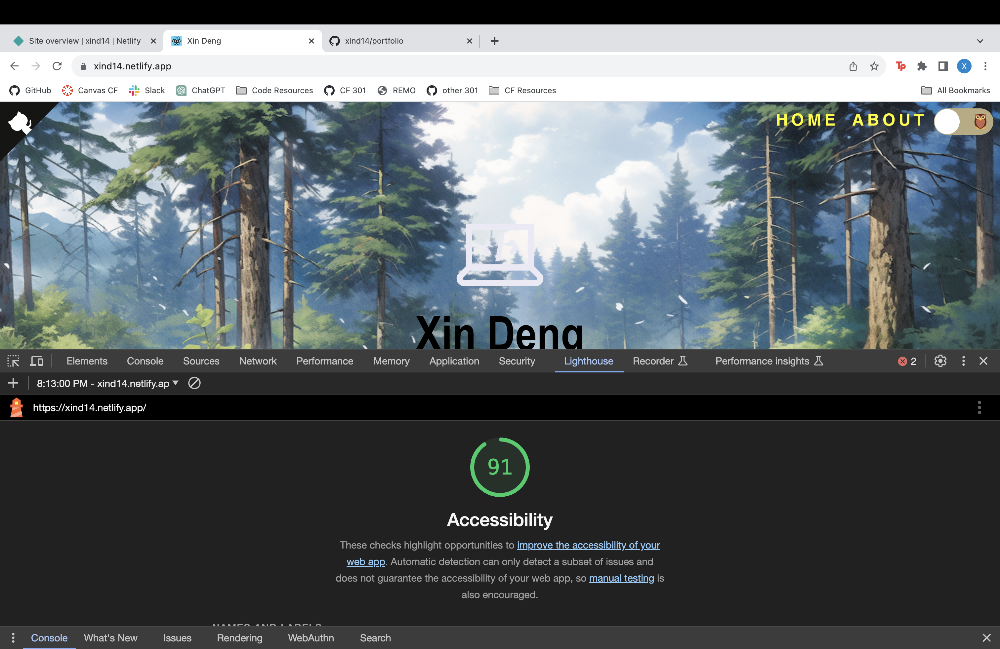

# My Portfolio

Here is the live [link](https://xind14.netlify.app/)

## Portfolio Lab 5

### Author: Xin Deng

### Time Estimate

1. Number and name of feature: Feature #1: Clone Template
    - Estimate of time needed to complete: 1 hr
    - Start time: 4:05pm
    - Finish time: 4:53pm
    - Actual time needed to complete: 50 minutes

1. Number and name of feature: Feature #2: About me page
    - Estimate of time needed to complete: 1 hrs
    - Start time: 4:53pm
    - Finish time: 5:22pm
    - Actual time needed to complete: 30 minutes

1. Number and name of feature: Feature 3: Projects section
    - Estimate of time needed to complete: 1 hrs
    - Start time: 5:22pm
    - Finish time: 7:01pm
    - Actual time needed to complete: 2 hours

1. Number and name of feature: Feature 3: Skills and Experience 
    - Estimate of time needed to complete: 30 minutes
    - Start time: 7:01pm
    - Finish time: 7:11pm
    - Actual time needed to complete: 10 minutes

1. Number and name of feature: Feature 3: Personalize
    - Estimate of time needed to complete: 1 hr
    - Start time: 7:11pm
    - Finish time: 8:11pm
    - Actual time needed to complete: 1 hr

### Links and Resources

### Lighthouse Accessibility Report Score

### Reflections and Comments

1. A link to the deployed version of your latest code. 
2. A question within the context of this lab assignment
    - How. Just how are you suppose to apply CSS when there's so many created for you and you don't know the names of IDs or Class. It was so frustrating. Console wasn't that helpful because it was showing styles in pages I didn't have access to.

3. An observation about the lab assignment, or related ‘Ah-hah!’ moment
    - Once I figured out what files I was suppose to making changes to things picked up.
4. How long you spent working on this assignment
    - Four and a half hours